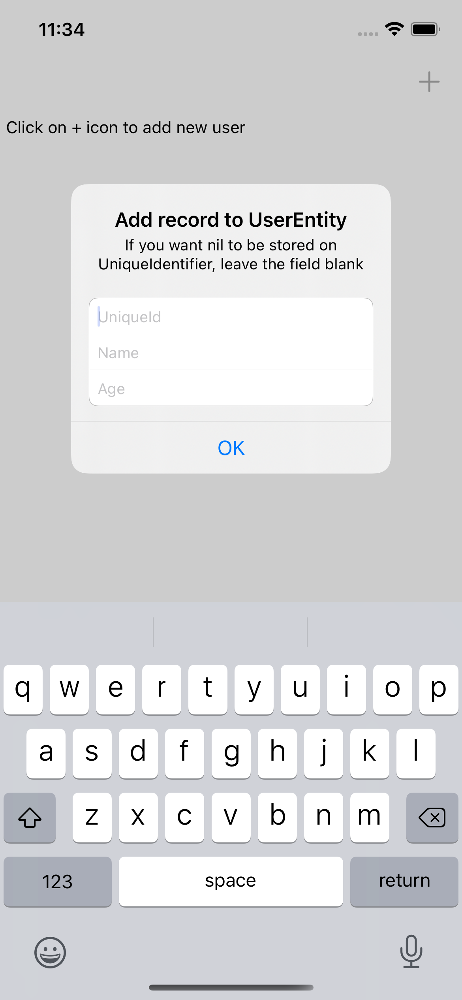

## CoreData-UniqueConstraint-Migration
> This app demonstrates the CoreData migration to set a parameter unqiue and avoid saving duplicate records

### Branches
- `main` - Initial project which allows duplicate records
- `final` - CoreData Migration which restricts duplicate records

### Components used in the app.
- Swift - as a programming language
- CoreData - Persistence framework for local storage

### Screenshots
Screenshot-1 | Screenshot-2 | Screenshot-3 |
---|---|---|
 |  |  

---
If this project helped you in any way, you can buy me a cup of coffee :) 

Thank you!
